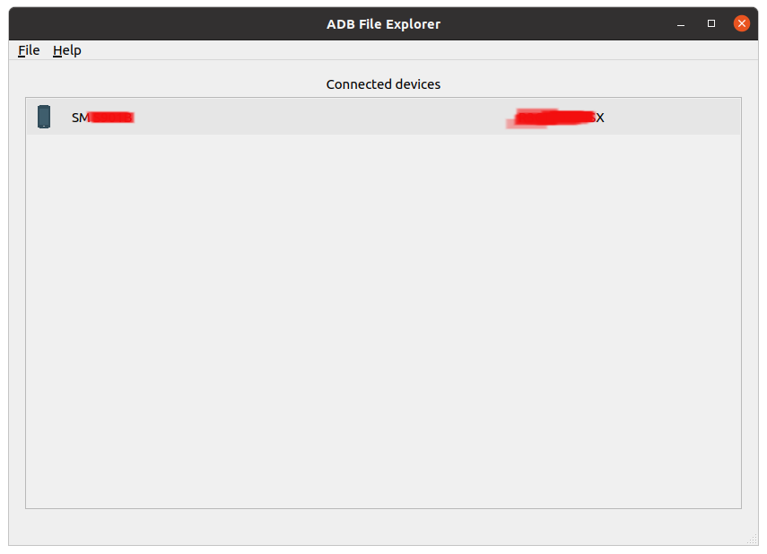
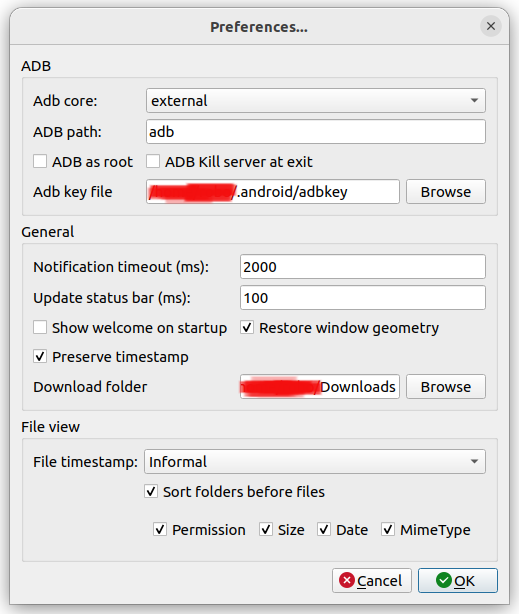

# ADB File Explorer


[](https://github.com/PyCQA/pylint)

Simple File Explorer for adb devices. Uses python library [`adb-shell`](https://github.com/JeffLIrion/adb_shell) or command-line tool [`adb`](https://developer.android.com/studio/command-line/adb).

Features:

* List of adb devices
* Connect via IP (TCP)
* Listing / Pulling / Pushing files
* Renaming and Deleting files

## Screenshots

No device:


Device detect:




Files


Preferences



## Requirements

* `Python3` (below version 3.8 not tested)
```shell
sudo apt-get install python3-pip python3-pyqt5  # For Linux Ubuntu
pip install PyQt5 libusb1 adb-shell
```
* `adb` (binary) should exist in project root folder or in `$PATH`

## Launch

1. Clone the repo
2. `cd ADBFileExplorer`
3. Setup python env


```shell
# First install python-venv in root folder. It should be like ADBFileExplorer/venv
pip install -r requirements.txt
run.bat # To start application on Windows
bash run.sh # To start application on Linux...
```

## License

```text
ADB File Explorer [python-app]
Copyright (C) 2022  Azat Aldeshov

This program is free software: you can redistribute it and/or modify
it under the terms of the GNU General Public License as published by
the Free Software Foundation, either version 3 of the License, or
(at your option) any later version.

This program is distributed in the hope that it will be useful,
but WITHOUT ANY WARRANTY; without even the implied warranty of
MERCHANTABILITY or FITNESS FOR A PARTICULAR PURPOSE.  See the
GNU General Public License for more details.

You should have received a copy of the GNU General Public License
along with this program.  If not, see <https://www.gnu.org/licenses/>.
```
